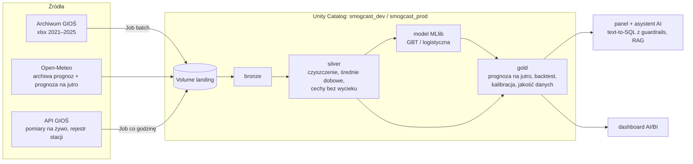

# smogcast — czy jutro w mieście Y zostanie przekroczona norma PM10 / PM2.5?

Platforma danych na Azure Databricks, która codziennie odpowiada na pytanie:

> **„Czy jutro w mieście Y zostanie przekroczona dobowa norma PM10 / PM2.5 i na ile to pewne?”**

dla 10 największych miast Polski. Odpowiedź to **prawdopodobieństwo** (0–100%) z modelu uczonego na pomiarach GIOŚ
2021–2024 i prognozach pogody Open-Meteo, sprawdzone na roku 2025, którego model nie widział — **w tych samych
miastach, dla których prognozuje**. Wynik oglądasz w panelu, pytasz o niego asystenta AI albo czytasz z tabel gold.

Projekt zaliczeniowy kursu Databricks (wymagania: [`final-project-spec.md`](final-project-spec.md)).
Stan: **E0–E7 zakończone, E8 (dokumentacja, CI) w trakcie, E9 (Databricks) — próbny deploy na DEV działa**;
plan, decyzje i dziennik: [`PLAN_SMOG.md`](PLAN_SMOG.md).

---

## Wynik w skrócie (rok testowy 2025, 10 miast)

Kryteria wiarygodności K1–K4 zamrożono **przed** treningiem ([`PLAN_SMOG.md`](PLAN_SMOG.md), sekcja 2a). Prognozę
pogody na jutro model dostaje z **prawdziwych prognoz wydanych dzień wcześniej**, nie z pogody, która wystąpiła.

| | PM10 (norma 50 µg/m³) | PM2.5 (próg 25 µg/m³) |
|---|---|---|
| Brier: model / klimatologia / „jutro jak dziś” | **0,0434** / 0,0615 / 0,0933 | **0,0751** / 0,117 / 0,172 |
| AUC | 0,95 | 0,94 |
| wykryte dni z przekroczeniem (POD) / fałszywe alarmy (FAR) | 44% / 32% | 70% / 27% |
| kalibracja („70%” znaczy 70%?) — największa rozbieżność | 8,5 p.p. (na granicy) | 7,2 p.p. |
| **werdykt K1–K4** | ❌ **nie spełnia** K4a (wykrywalność < 60%) | ✅ **spełnia** |

Model PM10 pokonuje obie proste reguły i dobrze porządkuje dni, ale przegapia ponad połowę dni z przekroczeniem —
raportujemy to wprost, zamiast zmieniać kryteria po fakcie. Dlaczego i co dalej:
[`docs/ulepszenia-pm10.md`](docs/ulepszenia-pm10.md). Wyniki są **identyczne lokalnie i na Databricks**.

## Architektura w skrócie



Trzy ścieżki: **A — historia i model** (batch), **B — na żywo** (Structured Streaming: deduplikacja, spóźnione,
kwarantanna, flagi zamrożenia/skoku/dryfu, prognoza na jutro), **C — CDC** rejestru stacji (migawki → SCD2).
Pełne diagramy, tabele i uzasadnienia: [`docs/ARCHITECTURE.md`](docs/ARCHITECTURE.md).

Najważniejsze decyzje projektowe:
- **Każdy krok potoku to osobny wheel** (`packages/<paczka>`) uruchamiany przez task Lakeflow Joba; wspólny kod tylko
  w `smogcast-core`. Środowiska (local / dev / prod) różnią się wyłącznie plikiem konfiguracji.
- **Cechy tylko z informacji dostępnej w chwili prognozy** (dziś, 12:00 CET); podział czasowy trening 2021–2023 /
  walidacja 2024 / test 2025, nigdy losowy.
- **Model musi pokonać dwie proste reguły**: klimatologię i persystencję („jutro jak dziś”).
- **Liczby w aplikacji nigdy nie pochodzą z modelu językowego** — tylko z tabel gold przez guardrails SQL.
- **Psucie danych do demo** (`fault_replay`) to kopia prawdziwych pomiarów z wstrzykniętymi usterkami, osobnym torem —
  nigdy nie dotyka danych modelu.

## Technologie

Spark 4 / Databricks Runtime 17.3 LTS, Delta Lake, Unity Catalog (katalogi, schematy, Volume'y), Lakeflow Jobs,
Structured Streaming, Spark MLlib, Databricks Asset Bundles, GitHub Actions, Terraform (osobne repo), Streamlit +
Plotly, `sqlglot` (guardrails), RAG z wyszukiwaniem hybrydowym (embeddingi + BM25), dowolny model językowy z API
zgodnym z OpenAI. Lokalnie wszystko działa w Dockerze.

## Uruchomienie lokalne (Docker)

Wymagania: Docker Desktop. Natywny Spark na Windowsie nie jest wspierany (Java 17, winutils) — wszystko idzie przez
`docker compose`.

```powershell
docker compose build                                              # raz, kilka minut
docker compose run --rm smogcast smogcast steps                   # lista kroków wszystkich wheeli
docker compose run --rm smogcast smogcast run-batch               # historia → model (prawdziwe dane, internet; długo)
docker compose run --rm smogcast smogcast run-live                # prognoza na jutro (po run-batch)
docker compose run --rm smogcast smogcast ask --city Kraków       # odpowiedź słowami
docker compose up -d app                                          # panel i asystent: http://localhost:8501
```

- Bez internetu: `smogcast --offline run-batch` — dane syntetyczne w `data-offline/` (tylko do sprawdzenia potoku,
  **wyniki nie są prawdziwe**).
- Demo czyszczenia danych: `smogcast run-fault-demo` + scenariusz [`docs/demo-jakosc-danych.md`](docs/demo-jakosc-danych.md).
- Asystent korzysta z modelu językowego przez API zgodne z OpenAI (lokalnie LM Studio na hoście,
  `SMOGCAST_LLM_BASE_URL`); bez modelu działa panel i `smogcast ask`.
- Dane (`data/`) powstają przy pierwszym uruchomieniu i nie trafiają do gita. Skąd pochodzą i na co uważać:
  [`docs/przygotowanie-danych.md`](docs/przygotowanie-danych.md).

## Testy i CI

```powershell
docker compose run --rm smogcast ruff check packages conftest.py
docker compose run --rm smogcast pytest -q -p no:logging -m "not integration"   # testy jednostkowe
docker compose run --rm smogcast pytest -q -p no:logging -m integration         # cały potok na danych syntetycznych (~3 min)
```

- **Testy jednostkowe** w `packages/<paczka>/tests/` — m.in. konwersje czasu, reguły jakości danych, brak wycieku
  przyszłości do cech, metryki na ręcznie policzonych przykładach, powtarzalność modelu, guardrails SQL.
- **Test integracyjny** (`packages/cli/tests/test_integration.py`) — historia → model → dwa odpytania na żywo → demo
  usterek na danych syntetycznych w formatach prawdziwych źródeł; sprawdza warstwy, idempotencję, werdykt K1–K4,
  prognozy i to, że każda usterka trafia we właściwe miejsce. Działa bez internetu.
- **CI** ([`.github/workflows/ci.yml`](.github/workflows/ci.yml)): lint → testy jednostkowe → test integracyjny →
  budowa wszystkich wheeli. Wdrożenie DEV → PROD z CI — etap E9.

## Wdrożenie na Databricks

```powershell
databricks bundle validate -t dev
databricks bundle deploy -t dev                    # buduje 7 wheeli kroków, tworzy 2 Joby
databricks bundle run -t dev smogcast_batch        # historia → model
databricks bundle run -t dev smogcast_live         # na żywo → gold.forecast_tomorrow
```

- Bundle: [`databricks.yml`](databricks.yml) (targety `dev` i `prod`; PROD wdraża tylko CI jako service principal),
  Joby: [`resources/`](resources/), skrypt Unity Catalog: [`sql/bootstrap_uc.sql`](sql/bootstrap_uc.sql).
- Infrastruktura Azure (Key Vault + secret scope, service principal z OIDC dla GitHub Actions, grupy pod RLS/CLS,
  katalog) — osobne repo Terraform `smog-cast-terraform`.
- Przygotowanie i przebieg pierwszego deployu: [`docs/poprawki-przed-deployem.md`](docs/poprawki-przed-deployem.md),
  [`docs/migracja-databricks.md`](docs/migracja-databricks.md).

## Wymagania kursu — gdzie są spełnione

| Wymaganie | Gdzie | Stan |
|---|---|---|
| medallion bronze → silver → gold, batch i streaming | ścieżki A i B, `packages/*` | ✅ (lokalnie i na DEV) |
| Unity Catalog: katalogi, schematy, Volume'y | `sql/bootstrap_uc.sql`, Terraform `unity_catalog` | ✅ DEV |
| RLS / CLS | `jurisdiction_code` (województwo) w gold, grupy z Terraforma | 🔜 E9 |
| sekrety w Key Vault | Terraform `secrets` (secret scope) | 🔜 E9 |
| jakość danych, idempotencja | `silver_clean` (kwarantanna, spóźnione, deduplikacja, flagi), zapisy idempotentne (`replaceWhere`, MERGE, `txnAppId`), demo usterek | ✅ |
| ewolucja schematu | `mergeSchema` w zapisach przyrostowych (`core/storage.py`); Auto Loader w pipeline deklaratywnym | 🚧 pełniej w E9 |
| pipeline deklaratywny Lakeflow + Lakeflow Job | Joby: `resources/` ✅; pipeline deklaratywny (Auto Loader + expectations) | 🔜 E9 |
| testy (jednostkowe + jakość danych) w CI | `packages/*/tests`, test integracyjny, `ci.yml` | ✅ / 🚧 zielony przebieg |
| Asset Bundle + CI/CD do PROD | `databricks.yml`; wdrożenie z GitHub Actions | 🚧 DEV ✅, PROD w E9 |
| dashboard na gold | panel Streamlit ✅; dashboard AI/BI | 🔜 E9 |
| aplikacja AI (RAG / asystent) | `packages/app` (text-to-SQL z guardrails + RAG) | ✅ lokalnie, hosting w E9 |
| zdolność zaawansowana | **CDC** rejestru stacji → SCD2 | ✅ |

## Dokumentacja

| Dokument | Zawartość |
|---|---|
| [`docs/HOWTOREAD.md`](docs/HOWTOREAD.md) | jak czytać repozytorium i tabele wynikowe; gdzie jest która logika |
| [`docs/ARCHITECTURE.md`](docs/ARCHITECTURE.md) | diagramy przepływu, wheele, grafy tasków, tabele, wyniki modelu |
| [`docs/przygotowanie-danych.md`](docs/przygotowanie-danych.md) | źródła danych, formaty, czas CET/lokalny/UTC, pułapki |
| [`docs/demo-jakosc-danych.md`](docs/demo-jakosc-danych.md) | scenariusz demo czyszczenia danych |
| [`docs/ulepszenia-pm10.md`](docs/ulepszenia-pm10.md) | dlaczego PM10 jest trudniejszy i jak go poprawić uczciwie |
| [`docs/rag-dokumenty.md`](docs/rag-dokumenty.md) | baza wiedzy asystenta |
| [`docs/poprawki-przed-deployem.md`](docs/poprawki-przed-deployem.md), [`docs/migracja-databricks.md`](docs/migracja-databricks.md) | wdrożenie na Databricks |
| [`PLAN_SMOG.md`](PLAN_SMOG.md) | plan, decyzje D1–D17, kryteria K1–K4, etapy i dziennik |
| [`docs/archive-radplume/`](docs/archive-radplume/) | poprzedni temat projektu (dyspersja radionuklidów) i dlaczego go zmieniliśmy |

## Ograniczenia (świadome)

- **PM10 nie spełnia kryterium wykrywalności** (44% < 60%), a kalibracja PM10 mieści się w kryterium z małym zapasem.
- Zbiór stacji na żywo jest trochę większy niż w historii (nowe stacje), a „miasto = najgorsza stacja” — więc cechy na
  żywo mogą być lekko zawyżone względem treningu.
- PM2.5 nie ma dziś dobowej normy w prawie polskim; próg 25 µg/m³ pochodzi z dyrektywy UE 2024/2881 (od 2030 r.).
- Prognoza jest wydawana dla miasta, nie dla dzielnicy czy stacji.

## Źródła danych

Pomiary jakości powietrza: **Główny Inspektorat Ochrony Środowiska** (archiwum i API GIOŚ). Prognozy pogody:
**Open-Meteo** (CC BY 4.0). Dokumenty bazy wiedzy: akty prawne PL i UE, GIOŚ, WHO — lista w
[`docs/rag-dokumenty.md`](docs/rag-dokumenty.md).
