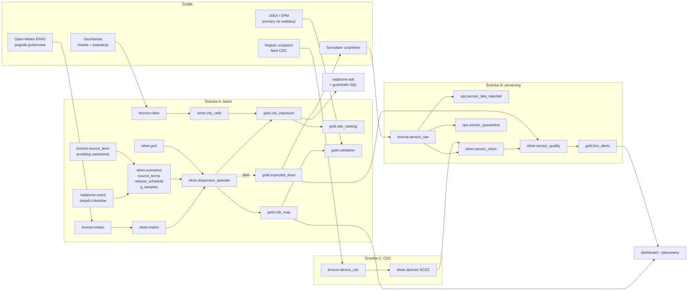
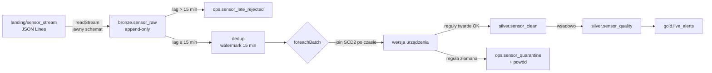
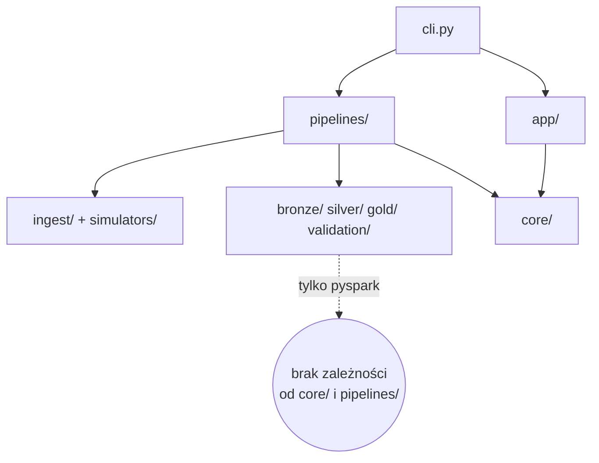

# Architektura radplume

Dokument opisuje, **jak zbudowana jest platforma i dlaczego tak**. Dotyczy stanu kodu
w repozytorium (lokalny PoC gotowy do przeniesienia na Databricks).

Powiązane dokumenty:
- [`README.md`](../README.md): jak uruchomić,
- [`docs/przygotowanie-danych.md`](przygotowanie-danych.md): jakie dane przygotować i gdzie je wrzucić,
- [`plan_finalny_radplume.md`](../plan_finalny_radplume.md): plan projektu, wymagania kursu, rejestr poprawek (P1–P21).

---

## Spis treści

1. [Cel i zakres](#1-cel-i-zakres)
2. [Widok ogólny](#2-widok-ogólny)
3. [Warstwy danych (medalion)](#3-warstwy-danych-medalion)
4. [Ścieżka A: batch (model i odpowiedź o miasta)](#4-ścieżka-a-batch)
5. [Ścieżka B: streaming (czujniki)](#5-ścieżka-b-streaming)
6. [Ścieżka C: CDC (rejestr urządzeń)](#6-ścieżka-c-cdc)
7. [Warstwa serwująca](#7-warstwa-serwująca)
8. [Struktura kodu i zależności między modułami](#8-struktura-kodu-i-zależności)
9. [Konfiguracja i środowiska](#9-konfiguracja-i-środowiska)
10. [Idempotencja i determinizm](#10-idempotencja-i-determinizm)
11. [Jakość danych](#11-jakość-danych)
12. [Skalowalność](#12-skalowalność)
13. [Przejście lokalnie → Databricks](#13-przejście-lokalnie--databricks)
14. [Decyzje architektoniczne](#14-decyzje-architektoniczne)
15. [Stan i dalsze kroki](#15-stan-i-dalsze-kroki)

---

## 1. Cel i zakres

**Pytanie, na które odpowiada platforma:**
> „Gdyby doszło do uwolnienia radionuklidów do atmosfery w elektrowni X, czy miasto Y
> zostanie skażone? Jak bardzo, jak szybko i przy jakiej pogodzie?”

Nie wiadomo, *kiedy* doszłoby do awarii ani *ile* by się uwolniło. Odpowiedź jest więc
**rozkładem po scenariuszach** (Monte Carlo), a nie jedną mapą: „w N% scenariuszy
przekroczono próg T”.

Platforma odpowiada na dwa rodzaje pytań, liczone tym samym modelem:

| Pytanie | Zestaw scenariuszy | Co losuje Monte Carlo |
|---|---|---|
| „Nie wiadomo kiedy: jaka jest szansa, że miasto Y zostanie skażone?” (analiza ryzyka lokalizacji) | `climatology` | **różne dni** z wieloletniej pogody + parametry fizyczne + ilość |
| „Znam dzień, godziny i ilości: gdzie pójdzie chmura?” (konkretne zdarzenie) | `event_…` | **zaburzenia pogody tego dnia** (kierunek, prędkość) + parametry + ilość |
| „Czy model odtwarza prawdziwą awarię?” (walidacja) | `validation_2011` | parametry + ilość; pogoda i przebieg uwolnienia prawdziwe |

| W zakresie | Poza zakresem |
|---|---|
| uwolnienie do atmosfery (awaria reaktora, pożar składowiska) | skażenie wód gruntowych i powierzchniowych |
| odległości do ok. 100 km od źródła | transport kontynentalny |
| Fukushima Daiichi (walidacja na prawdziwej awarii), Daini, Tokai, Lubiatowo-Kopalino | prognoza operacyjna, wsparcie decyzji kryzysowych |

---

## 2. Widok ogólny

Trzy ścieżki danych spotykają się w warstwie gold i w warstwie serwującej.



Dlaczego ścieżki się łączą:
- **A → B.** Symulator generuje dawkę z wyniku modelu (`gold.expected_dose`). Gdyby losował
  stałe tło, porównanie „pomiar vs model” nie miałoby sensu (plan P3).
- **C → B.** Każdy odczyt dostaje wersję urządzenia obowiązującą w chwili pomiaru
  (firmware, komórka, jurysdykcja).
- **A → B (jakość).** Dryf czujnika wykrywamy na reszcie względem modelu (plan P18).

---

## 3. Warstwy danych (medalion)

| Warstwa | Zasada | Przykłady |
|---|---|---|
| **landing** | pliki surowe dokładnie tak, jak przyszły ze źródła; działają też jako cache | JSON z Open-Meteo, TSV GeoNames, JSON Lines z czujników, CSV z pomiarami |
| **bronze** | tabela Delta z danymi *nie poprawianymi*, plus `source_file` i `ingest_ts`; nigdy nie usuwamy wierszy | `bronze.meteo`, `bronze.sensor_raw` (append-only) |
| **silver** | dane oczyszczone i zwalidowane + obliczenia fizyczne; odrzucone wiersze trafiają do `ops`, nie znikają | `silver.meteo`, `silver.dispersion_episode`, `silver.sensor_clean` |
| **gold** | agregaty odpowiadające na pytania biznesowe | `gold.city_exposure`, `gold.risk_map`, `gold.live_alerts` |
| **ops** | dane operacyjne: odrzucone rekordy i metryki jakości | `ops.sensor_quarantine`, `ops.sensor_late_rejected`, `ops.dq_metrics` |

**Silver i gold da się zawsze odtworzyć od zera z bronze.** Bronze jest jedynym źródłem
prawdy w platformie.

Fizyczne rozmieszczenie:

| | Lokalnie | Databricks (Unity Catalog) |
|---|---|---|
| landing | `data/landing/<źródło>/` | volume `/Volumes/radplume_<env>/raw/landing/<źródło>/` |
| tabele | `data/delta/<warstwa>/<tabela>/` (tabele ścieżkowe Delta) | `radplume_<env>.<warstwa>.<tabela>` |
| checkpointy strumieni | `data/checkpoints/<zapytanie>/` | `/Volumes/radplume_<env>/raw/checkpoints/<zapytanie>/` |

---

## 4. Ścieżka A: batch

### 4.1 Przepływ i strategie zapisu

| Krok CLI | Wejście | Wyjście | Strategia zapisu | Klucz / partycja |
|---|---|---|---|---|
| `ingest-meteo` | Open-Meteo API | `landing/meteo/<site>/<rok>.json` | plik tylko wtedy, gdy nie istnieje (cache) | — |
| `ingest-cities` | GeoNames | `landing/cities/` | jw. | — |
| `bronze` | landing | `bronze.meteo`, `bronze.cities` | **MERGE** / overwrite | `(site_id, time_utc)` |
| `bronze` | landing/source_term (opcjonalnie) | `bronze.source_term` | overwrite | — |
| `silver` | bronze | `silver.meteo` | **MERGE** | `(site_id, time_utc)` |
| | | `silver.grid`, `city_cells` | overwrite (małe, deterministyczne) | — |
| | | `silver.scenarios`, `source_terms`, `release_schedule`, `q_samples` | **replaceWhere** `scenario_set NOT LIKE 'event_%'` | — |
| `dispersion` | silver | `silver.dispersion_episode` | **replaceWhere** `site_id = … AND scenario_set NOT LIKE 'event_%'` | partycja `site_id` |
| `event` | silver + parametry CLI | cztery tabele scenariuszy i `dispersion_episode` | **replaceWhere** `scenario_set = 'event_…'`; potem cały krok `gold` | — |
| `gold` | silver | `gold.risk_map`, `city_exposure`, `site_ranking` | overwrite | partycja `site_id` (risk_map) |
| `validation` | gold + CSV pomiarów | `gold.validation_points`, `gold.validation` | overwrite | — |
| `expected-dose` | silver (jeden scenariusz demo) | `gold.expected_dose` | overwrite | — |

**MERGE** stosujemy tam, gdzie dane przychodzą przyrostowo (nowe lata pogody).
**replaceWhere** tam, gdzie przeliczamy cały wycinek od nowa: jest tak samo idempotentne,
a dużo tańsze niż MERGE na milionach wierszy, bo nie robi joinu ze starą wersją.
Wycinki są rozłączne: `run-batch` nie kasuje zdarzeń, a `event` nie kasuje klimatologii
ani innych zdarzeń.

### 4.2 Model fizyczny (`silver/dispersion.py`, `silver/puff.py`)

Wspólne elementy obu modeli transportu:

| Element | Realizacja |
|---|---|
| kierunek | kierunek lotu = kierunek wiatru + 180° (`silver/meteo.py`, test 270° → wschód) |
| stabilność | klasy Pasquilla A–F z wiatru, promieniowania i zachmurzenia (tabela Turnera) |
| dyspersja | σy, σz wg Briggsa (teren wiejski) |
| wiatr na wysokości uwolnienia | profil potęgowy `u10·(H/10)^p`, minimum 0,5 m/s |
| stężenie przy gruncie | wzór gaussowski z odbiciem od gruntu |
| depozycja sucha | `v_d · ∫χ dt` |
| depozycja mokra | `Λ · ∫χ dz dt`, `Λ = a·P^b` |
| rozpad | `exp(-λ · wiek obłoku)` |
| przebieg uwolnienia | ułamek całości w godzinie h z `silver.release_schedule` |

**Model `puff` (domyślny, `silver/puff.py`).** Masa uwolniona w godzinie h (ułamek z harmonogramu)
to jeden obłok startujący w połowie tej godziny:

1. **Trajektoria.** Obłok przesuwa się krokami 15 min. W każdym kroku bierze wiatr z bieżącej
   godziny, po zaburzeniu członka zespołu. Położenie to suma narastająca przesunięć (funkcja
   okna), więc trajektoria jest łamaną, która skręca razem z wiatrem. Śledzenie kończy się po
   `horizon_hours` (18 h) albo przy pierwszej godzinie bez pogody.
2. **Rozmycie.** σy i σz liczymy wzorami Briggsa od **przebytej drogi**, w punkcie odcinka
   najbliższym komórce. Rozmycie nie może maleć wzdłuż trajektorii: gdy zmiana klasy stabilności
   dałaby mniejsze σ, zostaje większe (maksimum narastające).
3. **Depozycja z odcinka, liczona analitycznie.** Obłok gaussowski przesuwający się ze stałą
   prędkością wzdłuż odcinka o długości L daje w punkcie dawkę całkowaną po czasie równą
   **wzorowi smugi × ΔΦ**, gdzie ΔΦ = Φ(a/σy) − Φ((a − L)/σy), a *a* to położenie punktu
   wzdłuż odcinka. Suma ΔΦ po kolejnych odcinkach daje pełne przejście chmury, więc nie ma
   „dziur” między pozycjami obłoku. Φ liczymy przybliżeniem erf (Abramowitz & Stegun,
   błąd < 1,5·10⁻⁷), bo Spark SQL nie ma funkcji erf, a Python UDF jest zakazany w silver.
4. **Wybór komórek.** Dla każdego odcinka bierzemy tylko komórki z prostokąta ±4σy wokół niego.
   Indeksy siatki wyliczamy wzorem, bez joinu z całą siatką.

**Własność kontrolna:** przy stałym wietrze `puff` daje ten sam wynik co `straight`. Test
`test_constant_wind_matches_straight_model` sprawdza to na osi smugi 5–100 km; zmierzona
różnica jest poniżej 1%. Test `test_turning_wind_…` pokazuje, że przy skręcającym wietrze
chmura dociera tam, gdzie prosta smuga nie dociera.

**Model `straight` (porównawczy, `hourly_unit_deposition`).** Każda godzina uwolnienia to
prosta, stacjonarna smuga z wiatrem tej godziny, lecąca przez cały zasięg. Jest 4–5 razy
tańszy, ale przy zmiennym wietrze myli kierunek dla odległości 50–100 km. Zostaje do porównań
w write-upie (`physics.transport.model: straight`).

Wszystkie wzory to wyrażenia kolumnowe Sparka (`Column → Column`). Te same funkcje
sprawdzamy w testach na kilku wierszach (wartości analityczne, bilans masy) i liczymy
na milionach wierszy w potoku.

### 4.3 Wymiary Monte Carlo

```
scenariusz = epizod × wariant (członek zespołu) × próbka ilości uwolnienia Q
             (kiedy?)  (jak się rozproszy? jaka pogoda?)  (ile?)
```

| Wymiar | `climatology` | `validation_2011` | `event_…` | Kosztuje przeliczenie transportu? |
|---|---|---|---|---|
| epizod | losowe starty z 10–20 lat ERA5 | prawdziwe daty 2011 | jeden: dzień zdarzenia | **tak** |
| wariant: fizyka | stabilność ±1, v_d, Λ, wysokość | jw. | jw. | **tak** |
| wariant: zaburzenie pogody | brak (niepewność pogody pokrywają różne dni) | brak | kierunek ~N(0, 15°), prędkość ~lognormal(0, 0,2) | **tak** |
| harmonogram uwolnienia | równomierny 24 h | z pliku Katata (albo równomierny) | z `--release` | nie (ułamki w tym samym przebiegu) |
| próbka Q | lognormal wokół `sites.yaml` | lognormal wokół sumy z pliku | lognormal wokół sumy z `--release` (×/÷ 2) | **nie**: model jest liniowy względem Q |

Tabele opisujące zestawy (`silver/scenarios.py`, `silver/events.py`):
- `silver.scenarios`: epizody × warianty,
- `silver.source_terms`: całkowita ilość (mediana, gsd, pochodzenie),
- `silver.release_schedule`: ułamek całości w godzinie h, suma = 1,
- `silver.q_samples`: próbki Q per zestaw.

**Liniowość względem Q** to najważniejsza decyzja wydajnościowa. Transport liczymy dla
uwolnienia 1 Bq rozłożonego w czasie według harmonogramu (`unit_dep_per_bq`), a próbki Q
mnożymy dopiero w gold. 100 próbek Q kosztuje tyle co jedna. Dlatego harmonogram jest
zapisany jako **ułamki**, a nie Bq na godzinę.

### 4.4 Agregacja (`gold/aggregates.py`)

Wiersze pod wiatr i daleko od osi smugi odcinamy przed agregacją (wydajność). Scenariusz
„smuga nie dotarła” nie ma więc wiersza, ale **musi liczyć się do mianownika**:
- `p_exceed = liczba scenariuszy ≥ próg / liczba WSZYSTKICH scenariuszy`,
- percentyle liczymy metodą *nearest rank* z niejawnymi zerami (bez fizycznego tworzenia zer).

`gold.city_exposure` ma wiersz dla **każdego** miasta w promieniu 100 km, także z `p_exceed = 0`.
„0%” to odpowiedź, a nie brak danych.

Progi skażenia (`thresholds.yaml`) są przeliczane na jedną jednostkę, depozycję w kBq/m².
Progi dawkowe (mSv/rok) przeliczamy przez współczynnik ground shine.

---

## 5. Ścieżka B: streaming



| Decyzja | Uzasadnienie |
|---|---|
| **spóźnienie liczone jawnie** `lag = sent_at − event_time`, bezstanowy filtr | watermark gubi rekordy po cichu i zależy od podziału na mikro-batche; jawny filtr jest deterministyczny, testowalny i zapisuje odrzucone rekordy (P1) |
| **watermark tylko do deduplikacji** | ogranicza stan (ile kluczy Spark pamięta); ma tę samą długość co reguła biznesowa, więc niczego nie gubi; kontrola: `rows_dropped_by_watermark` w `ops.dq_metrics` (≈ 0) |
| **`foreachBatch` + `txnAppId/txnVersion`** | jeden strumień zapisuje do dwóch tabel (clean + kwarantanna) exactly-once; powtórzony po awarii batch nie zapisze się drugi raz |
| **trigger `availableNow`** | przetwarza zaległości i kończy; nie trzyma klastra włączonego (plan V, zasada 1) |
| **reguły historyczne wsadowo** (`sensor_quality`) | funkcje okna po wierszach (`lag`) nie działają w Structured Streaming; na Databricks będzie to materialized view (P2) |
| **dryf = reszta względem modelu + sąsiedzi** | z-score na surowej dawce nie wykryłby dryfu (szum 35%) i myliłby przejście smugi z usterką; usterka jest lokalna, prawdziwe odchylenie obszarowe (P18) |

Statusy jakości (priorytet od najwyższego): `warmup` → `frozen` → `drift_suspect` → `wind_jump` → `clean`.

Typy alertów w `gold.live_alerts`:
- **`outside_model_band`** to realny sygnał. Powstaje **tylko** z odczytu `clean`, który wypada poza pasmo P5–P95 modelu.
- **`sensor_fault`** to problem jakości danych: dryf, zamrożenie, skok wiatru.
- **`is_significant`** oznacza alert uporczywy: co najmniej 25% odczytów w godzinie. Pasmo P5–P95 z definicji zostawia ok. 10% pojedynczych odczytów poza sobą.

---

## 6. Ścieżka C: CDC

Feed zmian rejestru urządzeń (`op` ∈ INSERT/UPDATE/DELETE, `seq`) → `silver.devices` jako **SCD typ 2**
(`valid_from`, `valid_to`, `is_current`):
- UPDATE firmware v1 → v2 tworzy nową wersję i zamyka poprzednią,
- DELETE zamyka ostatnią wersję i sam nie tworzy nowej,
- powtórzone zdarzenie (ten sam `device_id, seq`) jest ignorowane.

Lokalnie SCD2 powstaje z funkcji okna (pełne przeliczenie z bronze). Na Databricks zastąpi
je `dlt.create_auto_cdc_flow(..., stored_as_scd_type=2)` z tą samą semantyką, liczone przyrostowo.

---

## 7. Warstwa serwująca

`radplume ask --site X --city Y` (`app/city_query.py`):

1. rozpoznaje miasto (z polskimi znakami lub bez),
2. buduje **parametryzowane** zapytanie do `gold.city_exposure`, przepuszcza je przez guardrails i wykonuje,
3. składa odpowiedź po polsku **wyłącznie z liczb z wyniku zapytania**,
4. dołącza użyty SQL i zastrzeżenie o ograniczeniach modelu,
5. dla niemodelowanej lokalizacji albo miasta poza zasięgiem **odmawia**, zamiast zgadywać (P13).

**Guardrails** (`app/guardrails.py`) są wymuszane parserem sqlglot, a nie promptem:
- jedno zapytanie,
- tylko SELECT, także w podzapytaniach,
- tylko tabele warstwy gold,
- wymuszony LIMIT.

Na Databricks krok 2 wykona LLM (text-to-SQL, Foundation Model API) i przejdzie przez te same
guardrails. Zapytania pójdą z tożsamością użytkownika, więc obowiązuje RLS/CLS z Unity Catalog.

---

## 8. Struktura kodu i zależności

```
src/radplume/
├── conf/         YAML: środowiska + domena
├── core/         config, session, storage, dq_metrics
├── ingest/       prawdziwe źródła → landing
├── simulators/   dane symulowane → landing
├── bronze/  silver/  gold/  validation/   transformacje
├── app/          warstwa serwująca
├── pipelines/    orkiestracja (context, batch, stream, event)
└── cli.py        punkt wejścia
```

Kierunek zależności (strzałka = „importuje”):



| Warstwa kodu | Co robi | Czego NIE robi |
|---|---|---|
| **transformacje** (`bronze/silver/gold/validation`) | czyste funkcje `DataFrame → DataFrame` i wzory `Column → Column` | nie czytają plików ani konfiguracji, nie tworzą sesji, nie zapisują |
| **orkiestracja** (`pipelines/`) | czyta tabele wejściowe, woła transformację, zapisuje wynik; 1 krok = 1 task Joba | nie zawiera logiki obliczeń |
| **infrastruktura** (`core/`) | sesja Spark, ścieżki/katalog, konfiguracja | jedyne miejsce, które wie, czy działamy lokalnie, czy na Databricks |
| **źródła** (`ingest/`, `simulators/`) | zapis plików do landing, bez Sparka | nie transformują danych |

Dzięki temu transformacje testujemy na małych DataFrame'ach bez uruchamiania potoku,
a zmiana środowiska dotyka tylko `core/` i YAML.

Testy odzwierciedlają ten podział:
- `tests/unit/`: pojedyncze funkcje (fizyka, meteo, DQ, CDC, guardrails),
- `tests/integration/`: potok end-to-end w małej skali (idempotencja, spójność wyników).

---

## 9. Konfiguracja i środowiska

```
conf/physics.yaml, sites.yaml, thresholds.yaml, sensor_dq.yaml   ← wspólne dla wszystkich środowisk
                    +
conf/local.yaml | dev.yaml | prod.yaml                           ← TYLKO to, co różni środowiska
                    +
flagi CLI (--offline) / zmienne (RADPLUME_ENV, RADPLUME_DATA_DIR)
```

| | local | dev | prod |
|---|---|---|---|
| przechowywanie | `data/` (ścieżki) | `radplume_dev` (UC) | `radplume_prod` (UC) |
| lokalizacje | Daiichi, Lubiatowo | Daiichi, Lubiatowo | + Daini, Tokai |
| siatka | 41 × 5 km | 51 × 4 km | 101 × 2 km |
| epizody pogodowe | 12 (10 lat) | 20 (20 lat) | 200 (20 lat) |
| warianty × próbki Q | 3 × 30 | 3 × 50 | 5 × 100 |

Wszystkie siatki pokrywają ±100 km. Środowiska różnią się rozdzielczością i liczbą
scenariuszy, a nie zasięgiem. YAML jedzie w paczce (wheel), więc Job na Databricks ma
dokładnie tę konfigurację, którą testowaliśmy lokalnie. Przy starcie konfiguracja jest
walidowana: m.in. nieparzysta siatka i znane lokalizacje.

---

## 10. Idempotencja i determinizm

Ponowne uruchomienie dowolnego kroku z tymi samymi danymi daje ten sam wynik i nie
dubluje wierszy (sprawdza to `tests/integration/test_pipeline.py`).

| Mechanizm | Gdzie | Chroni przed |
|---|---|---|
| MERGE po kluczu naturalnym | `bronze.meteo`, `silver.meteo` | duplikaty przy ponownym wczytaniu plików |
| overwrite z `replaceWhere` po lokalizacji i zestawie | `silver.dispersion_episode`, tabele scenariuszy | stan mieszany po awarii w połowie; `run-batch` i `event` nie kasują sobie wyników |
| pełne nadpisanie, gdy w danych są nowe kolumny | `core/storage.py` | stare wiersze bez nowej kolumny (np. `scenario_set`) zostawione przez `replaceWhere` po aktualizacji kodu |
| pliki landing jako cache, zapis przez plik tymczasowy + rename | `ingest/` | ponowne odpytywanie API, połówki plików JSON |
| stałe nazwy plików + checkpoint strumienia | `simulators/`, `pipelines/stream.py` | ponowne przetworzenie tych samych odczytów |
| `txnAppId/txnVersion` | `foreachBatch` | podwójny zapis powtórzonego mikro-batcha |
| `random.Random(seed ^ crc32(nazwa))` | scenariusze, zdarzenia (klucz = nazwa zdarzenia), symulator | inne scenariusze przy innej liczbie rdzeni (`F.rand` zależy od partycji); `hash()` Pythona jest losowany przy starcie |
| `argmax` przez `max(struct(...))` zamiast `max_by` | gold, dispersion | inny wynik przy remisie zależnie od kolejności partycji |
| UTC w sesji Sparka i w procesie Pythona | `core/session.py` | przesunięcie godzin o 1–2 h między laptopem a klastrem |
| dokładne percentyle zamiast `percentile_approx` | gold | wynik zależny od kolejności danych |

Sumy liczb zmiennoprzecinkowych w Sparku mogą różnić się na ostatnim bicie zależnie od
kolejności partycji. Idempotencja oznacza więc te same wartości z dokładnością numeryczną
(test porównuje 10 cyfr znaczących), a nie identyczność bitową.

---

## 11. Jakość danych

| Miejsce | Reguła | Reakcja |
|---|---|---|
| `ingest/meteo.py` | jednostka wiatru `m/s`, czas UTC, równe długości tablic | plik **odrzucony** przed zapisem do landing (P21) |
| `silver/meteo.py` | kompletność zmiennych, fizyczny zakres wiatru i opadu | wiersz odrzucony, liczba w `ops.dq_metrics` |
| `silver/meteo.py` | `grid_elevation ≤ 0` dla lokalizacji lądowej | tylko ostrzeżenie (współrzędne podejrzane) |
| `pipelines/batch.py` | godziny epizodów bez meteo | metryka `episode_hours_missing_meteo` |
| `silver/puff.py` | brak pogody w trakcie lotu obłoku | śledzenie obłoku kończy się na pierwszej luce (nie zgadujemy wiatru) |
| `silver/scenarios.py` | uwolnienie z pliku poza oknem epizodu | pominięte, ostrzeżenie z odsetkiem pominiętej ilości |
| `silver/events.py` | niepoprawny zapis `--release`, ilość ≤ 0 | błąd przed startem Sparka |
| `silver/sensor_clean.py` | lag > 15 min | `ops.sensor_late_rejected` |
| | duplikat `(device_id, event_time)` | usunięty (dedup) |
| | wiatr poza 0–45 m/s, dawka poza zakresem detektora, brak dawki przy zasilaniu, nieznane urządzenie | `ops.sensor_quarantine` z listą złamanych reguł |
| `silver/sensor_quality.py` | dryf, zamrożenie, skok wiatru, warm-up | status odczytu (flaga, nie usunięcie) |
| `gold/live_alerts.py` | podsumowanie | `gold.sensor_dq_summary`: % spóźnionych, w kwarantannie, statusy |

Trzy poziomy reakcji są zróżnicowane świadomie. Odpowiadają `expect_or_fail`,
`expect_or_drop` i `expect` w Lakeflow:
- **odrzuć plik**: kontrakt źródła złamany,
- **odseparuj wiersz**: rekord nieużywalny, ale zachowany do analizy,
- **oflaguj**: rekord podejrzany, ale może być prawdziwy.

---

## 12. Skalowalność

| Technika | Gdzie | Efekt |
|---|---|---|
| liniowość względem Q | dispersion → gold | próbki ilości uwolnienia nie mnożą kosztu smugi |
| odcięcie wierszy pod wiatr i poza ±4σy | `hourly_unit_deposition` (straight) | większość iloczynu komórki × godziny odpada przed agregacją |
| komórki z prostokąta ±4σy wokół odcinka, indeksy liczone wzorem | `puff_unit_deposition` | kilka–kilkadziesiąt komórek na odcinek zamiast całej siatki |
| trajektoria liczona raz, nuklidy dołączane dopiero przy depozycji | `silver/puff.py` | koszt trajektorii niezależny od liczby nuklidów |
| harmonogram jako join wewnętrzny | oba modele | godziny bez uwolnienia (np. zdarzenie z 2 zrzutami) nie są liczone |
| `broadcast` małych tabel (siatka, nuklidy, lokalizacje, próbki Q, progi) | joiny | brak shuffle'a dużej strony |
| brak utrwalania wyniku godzinowego w klimatologii | `aggregate_episodes` | zapis N razy mniejszy (plan 3.4) |
| przypisanie punkt → komórka wzorem | `silver/grid.py` | bez joinu przestrzennego i bibliotek natywnych |
| partycjonowanie po `site_id` | `dispersion_episode`, `risk_map` | niezależne przeliczanie lokalizacji, pruning przy odczycie |
| zakaz pandas/UDF/`collect()` na dużych danych w silver/gold | cały kod transformacji | całość liczy optymalizator Sparka na executorach |

**Rząd wielkości (P20).** Model `puff`:
- Koszt rośnie z liczbą **odcinków trajektorii** (epizody × warianty × godziny uwolnienia × 72 kroki)
  razy liczbą komórek w prostokącie wokół odcinka.
- Zmierzone lokalnie (siatka 5 km): 62 tys. odcinków → ok. 490 tys. wierszy depozycji dla dwóch
  nuklidów, czyli ok. 4 komórki na odcinek i nuklid.
- PROD (200 × 5 × 24 × 72 ≈ 1,7 mln odcinków, siatka 2 km, więc ok. 6 razy więcej komórek na
  odcinek) daje rząd **10⁸ wierszy** w jednym przebiegu.
- Zapisywane są tylko agregaty. Model `straight` byłby dla PROD rzędu 0,5 mld obliczeń przed odcięciem.

**Znane granice:**
- Dokładne percentyle zbierają wartości grupy do tablicy (`collect_list`). W PROD to do ok. 100 tys.
  liczb na komórkę. Przy dalszym skalowaniu trzeba przejść na `percentile_approx` z korektą o udział zer.
- `collect()` jest używany wyłącznie na małych tabelach: parametry scenariuszy, rejestr urządzeń,
  oczekiwana dawka dla kilkunastu komórek demo.

---

## 13. Przejście lokalnie → Databricks

| Element | Lokalnie | Databricks | Zmiana w kodzie |
|---|---|---|---|
| tabele | ścieżki Delta | Unity Catalog | nie: `storage.mode` w YAML |
| pliki surowe | `data/landing/` | volume | nie: `landing_root` w YAML |
| sesja | budowana w `core/session.py` | sesja klastra (wykrywana po `DATABRICKS_RUNTIME_VERSION`) | nie |
| kroki | `radplume <krok>` | task Lakeflow Joba z tym samym entry pointem (`resources/job_radplume.yml`) | nie |
| strumień czujników | file source + jawny schemat | Auto Loader `cloudFiles` + `schemaEvolutionMode=addNewColumns` | tak: źródło w jednej funkcji, logika czyszczenia bez zmian |
| czyszczenie czujników | Structured Streaming + `foreachBatch` | pipeline deklaratywny Lakeflow (`expect_all_or_drop`, flow kwarantanny) | tak: te same funkcje w dekoratorach Lakeflow |
| `sensor_quality` | tabela nadpisywana | materialized view | tak: dekorator |
| SCD2 | funkcje okna | `create_auto_cdc_flow` | tak: jedna deklaracja |
| RLS/CLS | brak | `sql/governance.sql` jako task Joba (plan 4.6) | nowy plik |
| pytania | szablon SQL | text-to-SQL (Foundation Model API) + te same guardrails | nowy moduł w `app/` |

Wersje dopasowane do chmury: **Spark 4.0 + Delta 4.0** lokalnie odpowiada Databricks Runtime 17.x.
W obu miejscach ANSI SQL jest domyślnie włączony, więc kod jest ANSI-bezpieczny
(`try_element_at`, jawne warunki zamiast dzielenia przez zero).

---

## 14. Decyzje architektoniczne

| # | Decyzja | Odrzucona alternatywa | Dlaczego |
|---|---|---|---|
| D1 | model gaussowski w czystym Sparku | model lagranżowski (FLEXPART, HYSPLIT) | rubryka punktuje dane i testy, nie fizykę; wzory analityczne dają sprawdzalne testy |
| D2 | liczby tylko z gold, LLM tłumaczy | RAG „odpowiadający” na pytanie o skażenie | RAG wyszukuje teksty, a nie liczy smugi; LLM zmyśliłby liczby (P13) |
| D3 | prekalkulacja dla znanych lokalizacji | liczenie na żądanie dla dowolnego punktu | natychmiastowa odpowiedź, prostsze demo; decyzja użytkownika (opcja A) |
| D4 | lokalny układ współrzędnych w km | UTM / pyproj / Sedona | błąd < 0,5% w 100 km, zero bibliotek natywnych na klastrze |
| D5 | Q jako mnożnik w gold | pełne MC z Q w silver | liniowość modelu, koszt ×1 zamiast ×N |
| D6 | dokładne percentyle z niejawnymi zerami | `percentile_approx` | determinizm, poprawny mianownik |
| D7 | spóźnienie z `sent_at` + filtr | sam watermark | deterministyczne, testowalne, bez cichej utraty (P1) |
| D8 | dryf na reszcie vs model + sąsiedzi | z-score na surowej dawce | z-score nie wykrywa dryfu i tłumi prawdziwy sygnał (P18) |
| D9 | konfiguracja w paczce (`radplume/conf/`) | `config/` w katalogu repo | ten sam plik lokalnie i w wheelu na Databricks |
| D10 | Docker jako zalecane środowisko lokalne | natywny Windows | Spark na Windows wymaga winutils/hadoop.dll |
| D11 | ingest bez Sparka (requests + pliki) | Spark do pobierania z API | małe pliki, łatwa podmiana źródła, cache w landing |
| D12 | dane symulowane w osobnym pakiecie `simulators/` | razem z `ingest/` | od razu widać, co jest realne (ograniczenia, plan VIII) |
| D13 | harmonogram uwolnienia jako ułamki całości | Bq na godzinę w transporcie | zachowuje liniowość względem Q (D5); ta sama maszyneria dla klimatologii, walidacji i zdarzeń |
| D14 | zdarzenie jako osobny `scenario_set` w tych samych tabelach | osobne tabele / osobny potok | gold, `ask`, walidacja i dashboard działają bez zmian; wiele zdarzeń obok siebie |
| D15 | zaburzenie pogody stałe dla członka zespołu | niezależny szum co godzinę | odpowiada systematycznemu błędowi reanalizy dla danego dnia; szum godzinowy uśredniałby się i zaniżał rozrzut |
| D16 | model obłoków z analityczną całką wzdłuż odcinka (ΔΦ) | obłoki punktowe co krok; model lagranżowski cząstek | brak „dziur” między pozycjami obłoku; przy stałym wietrze zgodny ze smugą (test); reużywa przetestowanych wzorów |
| D17 | Φ z przybliżenia erf w wyrażeniach Sparka | Python UDF z `math.erf` / scipy | UDF zakazany w silver (plan 3.1), wolny i nieprzenośny; błąd przybliżenia < 1,5·10⁻⁷ |

---

## 15. Stan i dalsze kroki

**Działa lokalnie:**
- ścieżki A, B i C end-to-end,
- model obłoków (`puff`) z trajektoriami skręcającymi razem z wiatrem,
- harmonogram uwolnienia (w tym przebieg z pliku Katata dla walidacji 2011),
- tryb zdarzenia `radplume event` z zespołem zaburzonej pogody,
- `radplume ask` (także dla zdarzeń),
- walidacja depozycji (wymaga pliku z JAEA),
- 90 testów, CI.

Historia tych zmian i ich uzasadnienie: [`docs/plan-rozszerzen.md`](plan-rozszerzen.md).

**Następne kroki (kolejność według wartości dla walidacji i wymagań kursu):**
1. dostarczenie danych: przebieg uwolnienia (Katata 2015) i depozycja JAEA, potem pierwsza prawdziwa walidacja,
2. walidacja godzinowych stężeń w powietrzu (stacje SPM, Oura 2015) → `gold.validation_air`; model `puff` liczy już czas przejścia chmury,
3. dokładne współrzędne Lubiatowa-Kopalina (dokumenty PEJ),
4. blok 1–3 planu: workspace'y, bootstrap Unity Catalog, `databricks bundle deploy`, CI z deployem,
5. czyszczenie czujników jako pipeline deklaratywny Lakeflow, `sql/governance.sql` (RLS/CLS),
6. dashboard AI/BI i aplikacja AI (text-to-SQL + RAG) na Databricks.

**Ograniczenia modelu** są opisane w planie (Część VIII) i w README. Najważniejsze:
- płaski teren, wiatr jednorodny w przestrzeni (zmienny tylko w czasie), zasięg ok. 100 km,
- brak zubożenia chmury przez depozycję (konserwatywnie: zawyża depozycję daleko od źródła),
- meteo ok. 25 km,
- hipotetyczna ilość uwolnienia dla Lubiatowa,
- alerty czujników testują potok, a nie trafność modelu.
