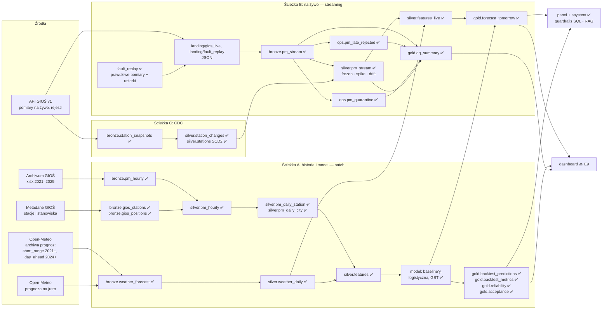
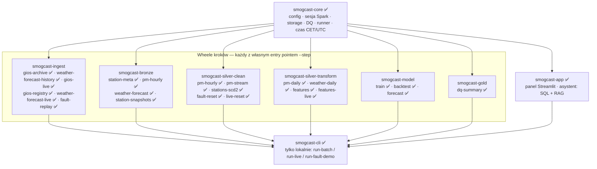
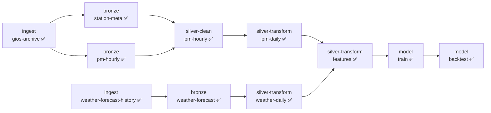
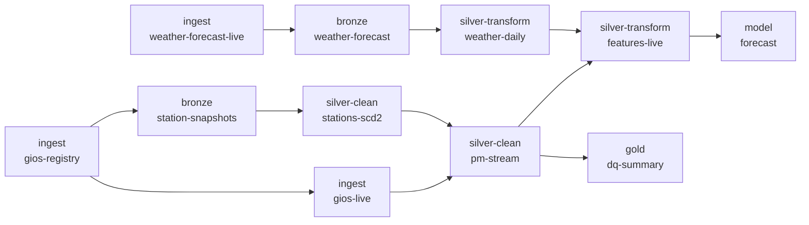
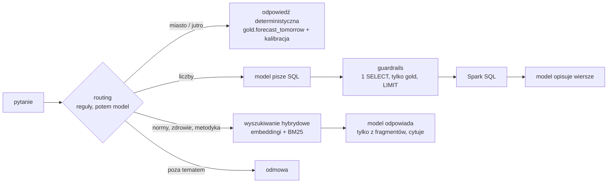
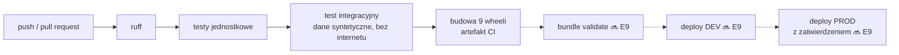

# Architektura smogcast

> **Dokument żywy.** Aktualizowany po każdym etapie z [`PLAN_SMOG.md`](../PLAN_SMOG.md).
> Oznaczenia: ✅ zaimplementowane i przetestowane · 🚧 w trakcie · 🔜 zaplanowane (etap w nawiasie).
> Stan na: **2026-10-06 — E0–E8 zakończone (E8: dokumentacja, test integracyjny, CI — zielony przebieg do
> potwierdzenia na GitHub Actions); E9: próbny deploy na Databricks DEV ✅ (Job batch i na żywo), reszta wymagań
> kursu 🔜.** Moduły radplume (`legacy/`) usunięte w E8 — stary temat tylko w [`archive-radplume/`](archive-radplume/).
>
> Jak czytać kod i tabele wynikowe: [`HOWTOREAD.md`](HOWTOREAD.md). Dane wejściowe i pułapki:
> [`przygotowanie-danych.md`](przygotowanie-danych.md). Testy i CI: [sekcja 9](#9-testy-i-ci).

Pytanie, na które odpowiada platforma:
> **„Czy jutro w mieście Y zostanie przekroczona norma PM10 / PM2.5 i na ile to pewne?”**

Definicje (doba w CET, ważność ≥ 18 h, progi 50 / 25 µg/m³) — `PLAN_SMOG.md`, sekcja 2.

---

## 1. Przepływ danych

Trzy ścieżki spotykają się w warstwie gold i w aplikacji.

```mermaid
flowchart LR
    subgraph src[Źródła]
        ARCH[Archiwum GIOŚ<br/>xlsx 2021–2025]
        META[Metadane GIOŚ<br/>stacje i stanowiska]
        API[API GIOŚ v1<br/>pomiary na żywo, rejestr]
        OMH[Open-Meteo<br/>archiwa prognoz:<br/>short_range 2021+, day_ahead 2024+]
        OML[Open-Meteo<br/>prognoza na jutro]
    end

    subgraph A[Ścieżka A: historia i model — batch]
        BPM[bronze.pm_hourly ✅]
        BST[bronze.gios_stations ✅<br/>bronze.gios_positions ✅]
        BWF[bronze.weather_forecast ✅]
        SPM[silver.pm_hourly ✅]
        SPD[silver.pm_daily_station ✅<br/>silver.pm_daily_city ✅]
        SWD[silver.weather_daily ✅]
        SF[silver.features ✅]
        MOD[model: baseline'y,<br/>logistyczna, GBT ✅]
        GBT[gold.backtest_predictions ✅<br/>gold.backtest_metrics ✅<br/>gold.reliability ✅<br/>gold.acceptance ✅]
    end

    subgraph B[Ścieżka B: na żywo — streaming]
        FR[fault_replay ✅<br/>prawdziwe pomiary + usterki]
        LND[landing/gios_live, landing/fault_replay<br/>JSON]
        BLV[bronze.pm_stream ✅]
        LATE[ops.pm_late_rejected ✅]
        QUAR[ops.pm_quarantine ✅]
        SST[silver.pm_stream ✅<br/>frozen · spike · drift]
        SFL[silver.features_live ✅]
        GFC[gold.forecast_tomorrow ✅]
        GDQ[gold.dq_summary ✅]
    end

    subgraph C[Ścieżka C: CDC]
        SNAP[bronze.station_snapshots ✅]
        SCD[silver.station_changes ✅<br/>silver.stations SCD2 ✅]
    end

    ARCH --> BPM --> SPM --> SPD --> SF
    META --> BST --> SPM
    OMH --> BWF --> SWD --> SF
    SF --> MOD --> GBT
    API --> LND
    FR --> LND
    LND --> BLV
    BLV --> LATE
    BLV --> QUAR
    BLV --> SST
    API --> SNAP --> SCD --> SST
    SST --> SFL
    OML --> BWF
    SWD --> SFL
    SFL --> GFC
    MOD --> GFC
    BLV & LATE & QUAR & SST --> GDQ

    GFC --> APP[panel + asystent ✅<br/>guardrails SQL · RAG]
    GBT --> APP
    GFC --> DASH[dashboard 🔜 E9]
    GBT --> DASH
    GDQ --> DASH
```

**Dlaczego tak:**
- **Model sprawdzamy tam, gdzie go używamy.** Backtest na latach 2021–2025 w tych samych 10 miastach.
- **Cechy tylko z informacji dostępnej w chwili prognozy** (doba D, 12:00 CET), a pogoda „na jutro” z **archiwum prognoz**, nie z pogody, która faktycznie wystąpiła — inaczej wynik backtestu byłby zawyżony. Trening: archiwum `short_range`; walidacja i test: **prawdziwe prognozy z poprzedniego dnia** (`day_ahead`, od 2024-01-19).
- **Kryteria „model jest wiarygodny” (K1–K4) zamrożone przed treningiem** — `PLAN_SMOG.md`, sekcja 2a.
- **Psucie danych zostaje** (`fault_replay`, E6): **kopia** prawdziwych pomiarów odtwarzana jako strumień z wstrzykniętymi usterkami, osobnym torem — historia dla modelu nigdy tych danych nie widzi (decyzja D17). Archiwum GIOŚ jest zweryfikowane i czyste (0 w kwarantannie, 0,1% flag), więc bez tego demo czyszczenia nie miałoby czego pokazać.

## 2. Wheele i Job (każdy krok = osobny wheel)

```mermaid
flowchart TB
    CORE[smogcast-core ✅<br/>config · sesja Spark · storage · DQ · runner · czas CET/UTC]

    subgraph steps[Wheele kroków — każdy z własnym entry pointem --step]
        ING[smogcast-ingest<br/>gios-archive ✅ · weather-forecast-history ✅ · gios-live ✅<br/>gios-registry ✅ · weather-forecast-live ✅ · fault-replay ✅]
        BRZ[smogcast-bronze<br/>station-meta ✅ · pm-hourly ✅<br/>weather-forecast ✅ · station-snapshots ✅]
        SCL[smogcast-silver-clean<br/>pm-hourly ✅ · pm-stream ✅ · stations-scd2 ✅<br/>fault-reset ✅ · live-reset ✅]
        STR[smogcast-silver-transform<br/>pm-daily ✅ · weather-daily ✅ · features ✅ · features-live ✅]
        MDL[smogcast-model<br/>train ✅ · backtest ✅ · forecast ✅]
        GLD[smogcast-gold<br/>dq-summary ✅]
    end

    APPW[smogcast-app ✅<br/>panel Streamlit · asystent: SQL + RAG]
    CLI[smogcast-cli ✅<br/>tylko lokalnie: run-batch / run-live / run-fault-demo]

    CORE --> ING & BRZ & SCL & STR & MDL & GLD & APPW
    ING & BRZ & SCL & STR & MDL & GLD & APPW --> CLI
```

| Gdzie | Kto uruchamia kroki | Jak |
|---|---|---|
| lokalnie (Docker) | `smogcast-cli` | `smogcast run-batch` albo `smogcast run <paczka> <krok>` |
| Databricks | Lakeflow Joby: `resources/job_smogcast.yml` (historia → model) i `resources/job_smogcast_live.yml` (na żywo, co godzinę) | task = `python_wheel_task` z wheelem kroku + `smogcast-core`, parametry `--step … --env dev/prod` |

Prognoza na jutro to krok **`model forecast`**, nie `gold`: potrzebuje zapisanego modelu i `prepare` z paczki
model, a paczki krokowe nie importują się nawzajem.

Zasady: paczki krokowe nie importują się nawzajem (tylko `core`); wszystkie mają tę samą wersję
(`VERSION`, pilnuje test); przestrzeń nazw `smogcast.*` (PEP 420). Szczegóły: `PLAN_SMOG.md`, sekcja 5a.

## 3. Graf tasków Joba (ścieżka A)

```mermaid
flowchart LR
    A1[ingest<br/>gios-archive ✅] --> B1[bronze<br/>station-meta ✅]
    A1 --> B2[bronze<br/>pm-hourly ✅]
    A2[ingest<br/>weather-forecast-history ✅] --> B3[bronze<br/>weather-forecast ✅]
    B1 --> C1[silver-clean<br/>pm-hourly ✅]
    B2 --> C1
    C1 --> D1[silver-transform<br/>pm-daily ✅]
    B3 --> D2[silver-transform<br/>weather-daily ✅]
    D1 --> D3[silver-transform<br/>features ✅]
    D2 --> D3
    D3 --> E1[model<br/>train ✅] --> E2[model<br/>backtest ✅]
```

Ta sama kolejność jest w `BATCH_ORDER` w `packages/cli/src/smogcast/cli/main.py` — oba miejsca trzeba zmieniać razem
(pilnuje tego test `packages/cli/tests/test_cli.py`).

## 3a. Graf tasków Joba na żywo (ścieżki B i C) ✅

Co godzinę (`:15`, harmonogram wstrzymany do demo). Lokalnie: `smogcast run-live` (`LIVE_ORDER`).

```mermaid
flowchart LR
    R1[ingest<br/>gios-registry] --> R2[bronze<br/>station-snapshots] --> R3[silver-clean<br/>stations-scd2]
    R1 --> L1[ingest<br/>gios-live]
    L1 --> L2[silver-clean<br/>pm-stream]
    R3 --> L2
    W1[ingest<br/>weather-forecast-live] --> W2[bronze<br/>weather-forecast] --> W3[silver-transform<br/>weather-daily]
    L2 --> F1[silver-transform<br/>features-live]
    W3 --> F1
    F1 --> F2[model<br/>forecast]
    L2 --> Q1[gold<br/>dq-summary]
```

Demo czyszczenia (`smogcast run-fault-demo`): `fault-reset` → `fault-replay` → `station-snapshots` → `stations-scd2`
→ `pm-stream` → `dq-summary` — za każdym razem te same usterki od zera; źródło `live` nietknięte.

## 4. Tabele

Lokalnie: `data/delta/<warstwa>/<tabela>/`; na Databricks: `smogcast_<env>.<warstwa>.<tabela>`.

| Tabela | Klucz / partycja | Zapis | Stan | Opis |
|---|---|---|---|---|
| `bronze.gios_stations` | station_code | overwrite | ✅ | stacje z metadanych GIOŚ, **także zamknięte**: miejscowość, współrzędne, daty działania, stare kody |
| `bronze.gios_positions` | position_code | overwrite | ✅ | stanowiska (np. `MpKrakAlKras-PM10-1g`): wskaźnik, czas uśredniania, typ pomiaru |
| `bronze.pm_hourly` | station_code, pollutant, time_utc / partycja `source_year` | replaceWhere po roku | ✅ | wszystkie stacje, PM10 i PM2.5, wartości 1-godzinne bez poprawek; `time_utc` = początek godziny; 2021–2025: 11,4 mln wierszy |
| `bronze.weather_forecast` | city_id, source, time_utc | overwrite | ✅ | prognoza godzinowa; `source` = `short_range` (2021+) / `day_ahead` (od 2024-01-19); 0,61 mln wierszy |
| `silver.station_city` | station_code | overwrite | ✅ | stacja → miasto (po miejscowości z metadanych), także stare kody → dzisiejszy kod |
| `silver.pm_hourly` | station_code, pollutant, time_utc / partycja `source_year` | overwrite | ✅ | tylko stacje 10 miast; `dq_flag` (`ok` / `frozen` / `spike`), `is_valid`, `day_cet`, `hour_cet`; 2,1 mln wierszy |
| `silver.pm_daily_station` | station_code, pollutant, day_cet | overwrite | ✅ | średnia dobowa (ważna przy ≥ 18 h), średnia poranna (00–10 CET) |
| `silver.pm_daily_city` | city_id, pollutant, day_cet | overwrite | ✅ | max i średnia po stacjach, `exceeded` (NULL = brak danych, nie „brak przekroczenia”) |
| `silver.weather_daily` | city_id, source, day_cet | overwrite | ✅ | agregaty prognozy na dobę CET: temperatura, wiatr, godziny ciszy, opad, … |
| `silver.features` | city_id, pollutant, issue_day | overwrite | ✅ | cechy z D-1, D-2, poranka D, prognozy pogody na D+1, kalendarza D+1; etykieta `exceeded_next_day`; `split`, `is_usable` |
| `gold.model_selection` | pollutant, model, params | overwrite | ✅ | siatka parametrów z Brierem walidacyjnym; `operational` = model wybrany na walidacji |
| `gold.backtest_predictions` | model, split, city_id, pollutant, issue_day | overwrite | ✅ | prawdopodobieństwo vs fakt (walidacja 2024, test 2025), także persystencja i klimatologia |
| `gold.backtest_metrics` | model, split, pollutant, city_id (+ `ALL`) | overwrite | ✅ | Brier, BSS, POD, FAR, CSI, AUC |
| `gold.reliability` | model, split, pollutant, bin | overwrite | ✅ | kalibracja: prognoza vs częstość |
| `gold.acceptance` | pollutant, model, criterion | overwrite | ✅ | werdykt K1–K4 na roku testowym |
| `bronze.station_snapshots` | snapshot_ts, station_id | overwrite | ✅ | migawki rejestru stacji API GIOŚ (`registry_source` = `gios_api` / `fault_replay`) |
| `silver.station_changes` | station_id, snapshot_ts | overwrite | ✅ | CDC: różnice kolejnych migawek → INSERT / UPDATE / DELETE |
| `silver.stations` | station_id, valid_from | overwrite | ✅ | SCD2 rejestru (`is_current`, `valid_to`) |
| `bronze.pm_stream` | — | append idempotentny (`txnAppId`) | ✅ | surowe odczyty strumienia; `source` = `live` / `fault_replay` |
| `silver.pm_stream` | source, station_code, pollutant, time_utc | MERGE | ✅ | strumień po czyszczeniu: `dq_flag` (`ok` / `frozen` / `spike` / `drift`), `status`, `lag_hours`; **oddzielna od `silver.pm_hourly`** (D17) |
| `silver.features_live` | city_id, pollutant, issue_day | MERGE | ✅ | cechy dnia wydania D (dziś CET) z `silver.pm_stream` (`live`) i prognozy pogody `live`; `is_usable`, `unusable_reason` |
| `gold.forecast_tomorrow` | city_id, pollutant, target_day | MERGE | ✅ | **odpowiedź na pytanie główne**: `probability`, `warned` (P ≥ 0,5), model operacyjny, `status` (`ok` / `no_forecast` z powodem), cechy objaśniające, `jurisdiction_code` (pod RLS) |
| `gold.dq_summary` | source, metric | overwrite | ✅ | jakość strumienia per źródło: unikalne odczyty, ponowne wysyłki, spóźnione, kwarantanna wg powodu, flagi; % unikalnych |
| `ops.pm_quarantine` | — | replaceWhere `source` (archiwum) / append (strumień) | ✅ | odczyty łamiące reguły twarde lub z nieznanej stacji, z powodem; `source` = `archive` / `live` / `fault_replay` |
| `ops.pm_late_rejected` | — | append idempotentny | ✅ | odczyty spóźnione (> 3 h i należne już przy poprzednim odpytaniu) |
| `ops.dq_metrics` | — | append | ✅ | dziennik metryk jakości z każdego kroku |

## 5. Czas (decyzja D13)

| Źródło | Konwencja w źródle | W tabelach |
|---|---|---|
| archiwum GIOŚ | **koniec** godziny, **CET** (UTC+1 cały rok), szum ms w Excelu | `time_utc` = **początek** godziny w UTC (`smogcast.core.timeutil`) |
| API GIOŚ (na żywo, `getData`, `archivalData`) | **koniec** godziny, czas lokalny Europe/Warsaw (z czasem letnim) | jw. |
| Open-Meteo | UTC (`timezone=GMT`) | jw. |
| „doba” średniej dobowej | — | `day_cet` = dzień kalendarzowy w CET |

Przykład: wartość „2025-01-01 01:00” z archiwum to godzina 00:00–01:00 CET, czyli `time_utc = 2024-12-31 23:00`.

## 6. Wyniki modelu (rok testowy 2025)

Kryteria zamrożone przed treningiem (`PLAN_SMOG.md`, sekcja 2a). Szczegóły: `PLAN_SMOG.md`, etap E5. Wyniki po
poprawce powtarzalności (2026-10-06) — **identyczne lokalnie i na Databricks DEV**.

| | PM10 (GBT gł. 3, 100 drzew) | PM2.5 (GBT gł. 5, 50 drzew) |
|---|---|---|
| Brier: model / klimatologia / persystencja | 0,0434 / 0,0615 / 0,0933 | 0,0751 / 0,117 / 0,172 |
| BSS vs klimatologia · AUC | 0,30 · 0,95 | 0,36 · 0,94 |
| POD / FAR | 44% / 32% | 70% / 27% |
| Kalibracja (K3, ≤ 15 p.p.) | 8,5 p.p. ✅ — **na granicy, kruche** | 7,2 p.p. ✅ |
| Werdykt K1–K4 | ❌ nie spełnia K4a (wykrywalność) | ✅ spełnia |

**Dlaczego PM10 gorzej niż PM2.5:** PM2.5 to głównie pył ze spalania, który zależy od pogody znanej z prognozy
(mróz, cisza wiatrowa). PM10 zawiera dodatkowo pył grubszy z ulic, budów i ziemi — tych czynników nie ma w modelu.
Do tego przekroczenia PM10 są rzadsze (~8% dni) i wymagają silniejszego epizodu. Model PM10 dobrze porządkuje dni
od najmniej do najbardziej groźnych (AUC 0,95), ale przegapia ponad połowę dni z przekroczeniem, a jego kalibracja
jest na granicy kryterium (w wersjach różniących się tylko szumem obliczeń K3 wahało się 8,5–21 p.p.). Kierunki
poprawy: `docs/ulepszenia-pm10.md`.

**Powtarzalność:** GBT był czuły na szum zmiennoprzecinkowy i podział danych na partycje (inne drzewa w Dockerze i na
klastrze). Dlatego cechy są zaokrąglane do 6 miejsc (`prepare.ROUND_DECIMALS`), a trening dostaje dane w jednej,
uporządkowanej partycji (`train.fit_input`).

**Jaki to model:** uczenie maszynowe nadzorowane — klasyfikacja binarna (jutro przekroczenie: tak/nie) z
prawdopodobieństwem, Spark MLlib (gradient boosted trees; regresja logistyczna jako porównanie). Uczony w E5 na
2021–2024 i zapisany (`data/models/`); w E6 ten sam zapisany model codziennie liczy prognozę na jutro z bieżących danych.

## 7. Prognoza na żywo (E6) ✅

Codziennie (Job co godzinę, lokalnie `smogcast run-live`): cechy dnia D (dziś w CET) z oczyszczonego strumienia `live`
(te same funkcje średnich i reguła 18 h co w historii) + prognoza pogody `live` na D+1 → zapisany model operacyjny
`final` → `gold.forecast_tomorrow`. Miasto bez wczorajszych danych PM albo bez pełnej prognozy pogody dostaje wiersz
`status = no_forecast` z powodem — nigdy zgadywaną wartość.

Pierwsze prawdziwe wydanie (2026-10-01 → 2026-10-02): 20/20 prognoz; ostrzeżenie tylko dla Wrocławia PM10 (P = 0,51:
wczoraj 49,1 µg/m³ przy normie 50, prognozowana cisza wiatrowa), Kraków PM10 0,48, pozostałe ≤ 0,34.

**Ograniczenie:** zbiór stacji na żywo (rejestr API) jest trochę większy niż w historii (np. Warszawa 8 vs 6 stacji PM10).
Przy definicji „miasto = najgorsza stacja” więcej stacji to systematycznie wyższe maksimum — cechy na żywo mogą być
nieco zawyżone względem treningu.

## 8. Aplikacja: panel i asystent (E7) ✅

```mermaid
flowchart LR
    Q[pytanie] --> R{routing<br/>reguły, potem model}
    R -->|miasto / jutro| F[odpowiedź deterministyczna<br/>gold.forecast_tomorrow + kalibracja]
    R -->|liczby| S[model pisze SQL] --> G[guardrails<br/>1 SELECT, tylko gold, LIMIT] --> SP[Spark SQL] --> M1[model opisuje wiersze]
    R -->|normy, zdrowie, metodyka| H[wyszukiwanie hybrydowe<br/>embeddingi + BM25] --> M2[model odpowiada<br/>tylko z fragmentów, cytuje]
    R -->|poza tematem| O[odmowa]
```

| Element | Gdzie | Uwagi |
|---|---|---|
| panel (Info, Tomorrow, City, Model, Data quality) i czat (Assistant) | `packages/app/src/smogcast/app/ui/` | Streamlit; `docker compose up app` → http://localhost:8501; każdy widok z danymi pokazuje swój SQL; **Info** (od 2026-10-02) = jak działa prognoza prostym językiem (progi i ustawienia z konfiguracji, werdykt z gold); strona Model objaśnia wykres kalibracji na przykładzie z `gold.reliability` |
| uruchamianie potoku | lokalnie **ręcznie** (`smogcast run-live`); na Databricks Job co godzinę (E9) | panel tylko czyta gold — nie pobiera danych sam |
| model językowy | `conf/app.yaml` + `SMOGCAST_LLM_*` | dowolny endpoint zgodny z OpenAI (LM Studio lokalnie; w chmurze Model Serving) |
| baza wiedzy | `docs/rag/*.md` + `ingest rag-documents` → `data/landing/rag/_zrodlo/` → `smogcast-app build-index` → `data/models/rag_index/` | lista i uzasadnienie źródeł: `docs/rag-dokumenty.md` |

**Język:** cała aplikacja (interfejs, odpowiedzi, baza wiedzy) jest po angielsku; polskie źródła jako nieoficjalne
tłumaczenia (`docs/rag-dokumenty.md`).

**Zasada:** liczby o prognozie i jakości modelu nigdy nie pochodzą z modelu językowego — tylko z tabel gold przez
guardrails; wiedza — tylko z dokumentów, ze źródłami. Ograniczenie (ocena na `qwen2.5-7b`): mały model potrafi pomylić
dwie wartości z tego samego fragmentu (poziom informowania vs alarmowy), dlatego źródła są zawsze widoczne.

## 9. Testy i CI

| Poziom | Gdzie | Co sprawdza | Czas |
|---|---|---|---|
| jednostkowe | `packages/<paczka>/tests/` | czyste funkcje DataFrame → DataFrame na małych, ręcznie zbudowanych danych: konwersje czasu, reguły jakości (kwarantanna, zamrożenie, skok, dryf vs prawdziwy epizod), reguła 18 h, **brak wycieku** w cechach, metryki na ręcznie policzonym przykładzie, logika K1–K4, powtarzalność GBT, CDC/SCD2, guardrails SQL, kontrakty API (jednostki, UTC), zgodność Jobów z CLI, wersje wheeli | ~3 min |
| integracyjny | `packages/cli/tests/test_integration.py` (znacznik `integration`) | cały potok na danych z `smogcast.ingest.synthetic` (pliki w formatach prawdziwych źródeł): historia → model → 2× na żywo → demo usterek; warstwy niepuste, ponowne uruchomienie bez dubli, wybór modelu i K1–K4, prognozy na jutro, usterki w kwarantannie/odrzuconych/flagach, CDC | ~3 min |
| na prawdziwych danych | ręcznie: `smogcast run-batch`, `run-live`, `run-fault-demo`; na DEV — Joby | wyniki porównywane między laptopem a Databricks (te same werdykty i liczby) | dziesiątki minut |

Test integracyjny wykrył dwa błędy, których testy jednostkowe nie widziały (parser metadanych przy krótszych wierszach
xlsx, liczba stacji w generatorze) — dlatego jest w CI.

```mermaid
flowchart LR
    P[push / pull request] --> L[ruff] --> U[testy jednostkowe] --> I[test integracyjny<br/>dane syntetyczne, bez internetu] --> W[budowa 9 wheeli<br/>artefakt CI]
    W -.-> V[bundle validate 🔜 E9] -.-> D[deploy DEV 🔜 E9] -.-> PR[deploy PROD<br/>z zatwierdzeniem 🔜 E9]
```

CI: [`.github/workflows/ci.yml`](../.github/workflows/ci.yml) — Python 3.11, Java 17, `smogcast-core[local]` (PySpark +
delta-spark tylko lokalnie i w CI; wheele ich nie ciągną, bo Databricks ma własne).

## 10. Środowiska i wdrożenie

| | local | DEV | PROD |
|---|---|---|---|
| gdzie | Docker na laptopie | workspace Azure Databricks na koncie autora | workspace na koncie kursu |
| zapis | `data/delta/…` (`storage.mode: path`) | `smogcast_dev.<warstwa>.<tabela>`, Volume'y `smogcast_dev.raw.*` | `smogcast_prod…` |
| uruchamia | `smogcast run-…` | Lakeflow Joby z bundla (`mode: development`) | te same Joby (`mode: production`) |
| tożsamość Jobów | — | osoba wdrażająca | service principal (`run_as`) |
| wdraża | — | `databricks bundle deploy -t dev` (laptop, docelowo CI) | **tylko CI** (GitHub Actions + OIDC) |
| stan | ✅ | ✅ walidacja potoku 2026-10-06 (do odtworzenia na nowym koncie Azure) | 🔜 E9 |

- Różnice między środowiskami są **tylko** w `conf/<env>.yaml` i targetach `databricks.yml` (adres, typ maszyny, `run_as`).
- **Infrastruktura w osobnym repo Terraform** (`smog-cast-terraform`): moduły `unity_catalog` (katalog, schematy,
  Volume'y), `secrets` (Key Vault + secret scope), `identity` (service principal, uprawnienia, federacja OIDC z GitHub
  Actions), `governance` (grupy pod RLS/CLS: administratorzy, analitycy, grupa na województwo). To repo dostaje z niego
  tylko wartości wyjściowe (host, id principala, katalog).
- **Aplikacja** (panel + asystent) nie jest częścią bundla: docelowo hostowana na Azure, czyta gold przez SQL Warehouse
  (E9).
