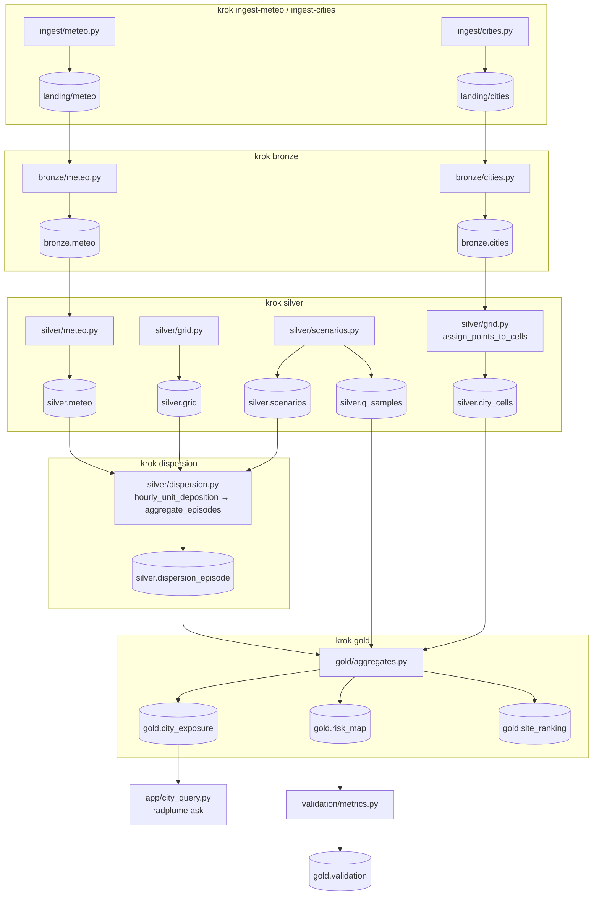
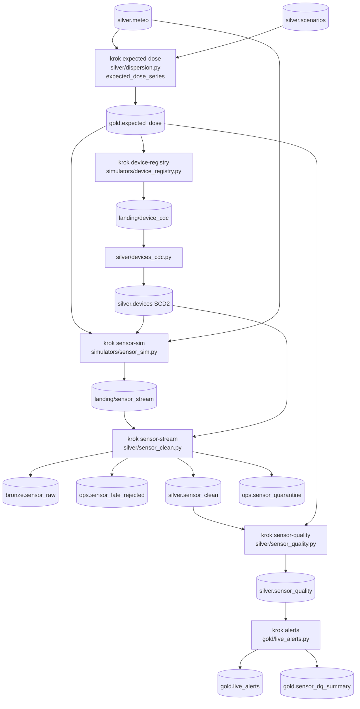

# Jak czytać ten kod

Przewodnik po repozytorium: od czego zacząć, za co odpowiada każdy plik i jak pliki
łączą się ze sobą. Architektura i uzasadnienia decyzji są w [`ARCHITECTURE.md`](ARCHITECTURE.md),
a przygotowanie danych w [`przygotowanie-danych.md`](przygotowanie-danych.md).

---

## 0. Najpierw jedno nieporozumienie: czujniki NIE są wejściem modelu

Łatwo pomyśleć, że na początku do bronze wczytujemy surowe dane z czujników razem z pogodą,
a potem Monte Carlo robi z nich scenariusze. **Tak nie jest.** Kolejność jest odwrotna,
a czujniki to osobna, późniejsza ścieżka:

```
KROK 1  Pogoda (prawdziwa, ERA5) ──► bronze.meteo ──► silver.meteo
                                                         │
KROK 2  Monte Carlo: tabela scenariuszy (MAŁA, 75 wierszy) ──┤
                                                         ▼
KROK 3  Model smugi: scenariusze × godziny × komórki siatki × nuklidy  ◄── TU jest „eksplozja” wierszy
                                                         │
KROK 4  Agregacja → gold.city_exposure  ◄── odpowiedź „czy miasto Y zostanie skażone?”
─────────────────────────────────────────────────────────────── koniec ścieżki A (model)
KROK 5  Z JEDNEGO scenariusza modelu liczymy oczekiwaną dawkę (gold.expected_dose)
KROK 6  Symulator czujników GENERUJE odczyty na podstawie tej dawki + celowe usterki
KROK 7  Odczyty czujników ──► bronze.sensor_raw ──► czyszczenie ──► alerty
─────────────────────────────────────────────────────────────── ścieżka B (czujniki)
```

Najważniejsze fakty:

1. **Model (ścieżki A) w ogóle nie używa czujników.** Jego wejście to pogoda, położenie
   elektrowni, parametry fizyczne i lista miast.
2. **Czujniki powstają Z modelu, a nie odwrotnie.** Nie mamy prawdziwej sieci czujników
   (EURDEP ma zakaz wykorzystania danych). Symulator bierze więc dawkę przewidzianą przez
   model i dokłada szum oraz celowe usterki: awarie łączności, spike, dryf, zamrożenie.
3. **Po co w takim razie czujniki?** Ścieżka B pokazuje umiejętność czyszczenia brudnych
   danych strumieniowych, czego wymaga kurs (streaming, jakość danych, schema evolution).
   Symuluje sytuację w trakcie awarii: pomiary na żywo porównuje się z przewidywaniem modelu.
   **Nie służy do sprawdzania trafności modelu.** Do tego jest walidacja na prawdziwych
   pomiarach z Fukushimy (JAEA), patrz `validation/`.
4. **Monte Carlo nie tworzy nowych danych wejściowych.** Tworzy małą tabelę „przepisów
   na scenariusz” (`silver.scenarios`: kiedy awaria, jaka wersja fizyki). Dużo wierszy
   pojawia się dopiero w kroku 3, gdy każdy scenariusz liczymy dla każdej godziny i każdej
   komórki siatki. I nawet tam zapisujemy tylko wynik zagregowany.

### Ile wierszy jest na każdym etapie (rzeczywiste liczby z przebiegu `--offline`, konfiguracja `local`)

| Etap | Tabela | Wierszy | Skąd ta liczba |
|---|---|---|---|
| pogoda | `bronze.meteo` | 175 584 | 2 lokalizacje × 10 lat × 8760 h (+ 10 dni marca 2011 dla Fukushimy) |
| siatka | `silver.grid` | 3 362 | 2 lokalizacje × 41 × 41 komórek |
| **scenariusze MC** | `silver.scenarios` | **75** | 2 × (12 epizodów × 3 warianty) + 3 walidacyjne. Mała tabela! |
| próbki ilości uwolnienia | `silver.q_samples` | 120 | 2 lokalizacje × 2 nuklidy × 30 próbek |
| **model: iloczyn** (w pamięci, niezapisywany) | — | **~2,9 mln** (dla Lubiatowa) | 36 scenariuszy × 24 h × 1681 komórek × 2 nuklidy |
| model: po odcięciu komórek, do których smuga nie leci | — | ~101 tys. | ok. 3,5% iloczynu: reszta leży pod wiatr albo daleko od osi smugi |
| model: zapisany wynik | `silver.dispersion_episode` | 49 776 | suma po godzinach → 1 wiersz na (scenariusz, komórka, nuklid) |
| gold: × próbki Q (w pamięci) | — | ~1,5 mln | każdy wiersz × 30 próbek ilości uwolnienia |
| **gold: odpowiedzi** | `gold.risk_map` | 16 528 | komórki × progi skażenia, z prawdopodobieństwami |
| **gold: odpowiedzi o miasta** | `gold.city_exposure` | 160 | miasta w promieniu 100 km × 4 progi × zestawy scenariuszy |
| — ścieżka B — | | | |
| oczekiwana dawka (1 scenariusz demo) | `gold.expected_dose` | 201 720 | 1681 komórek × 120 h |
| odczyty czujników | `bronze.sensor_raw` | 1 750 | 10 czujników × 180 minut (minus awarie i wycofane urządzenie) |
| po czyszczeniu | `silver.sensor_clean` | 1 711 | minus 17 spóźnionych i 12 w kwarantannie |

Kształt „lejka” jest typowy dla symulacji: **mało danych wejściowych → ogromny iloczyn
w trakcie obliczeń → mały, zagregowany wynik.** W PROD iloczyn to setki milionów wierszy
(plan P20), dlatego odcinamy je przed agregacją i nie zapisujemy wyniku godzinowego.

---

## 1. Kolejność czytania (ścieżka nauki)

Nie czytaj plików alfabetycznie. Czytaj w kolejności przepływu danych:

| # | Plik | Co z niego wyniesiesz |
|---|---|---|
| 1 | `src/radplume/conf/local.yaml`, `sites.yaml` | jakie lokalizacje, jaka skala, skąd dane |
| 2 | `src/radplume/cli.py` | lista wszystkich kroków i jak się je uruchamia |
| 3 | `src/radplume/pipelines/batch.py` | **spis treści ścieżki A**: każda funkcja `step_*` czyta tabele, woła transformację, zapisuje |
| 4 | `src/radplume/ingest/meteo.py` → `bronze/meteo.py` → `silver/meteo.py` | droga pogody od API do klasy stabilności |
| 5 | `src/radplume/silver/scenarios.py` | jak powstaje tabela scenariuszy MC |
| 6 | `src/radplume/silver/dispersion.py` | **serce projektu**: model smugi |
| 7 | `src/radplume/gold/aggregates.py` | jak z tysięcy scenariuszy powstaje „15% szans” |
| 8 | `src/radplume/app/city_query.py` | jak wygląda odpowiedź dla użytkownika |
| 9 | `src/radplume/pipelines/stream.py` | **spis treści ścieżek B i C** (czujniki, rejestr urządzeń) |
| 10 | `simulators/` → `silver/sensor_clean.py` → `silver/sensor_quality.py` → `gold/live_alerts.py` | brudne dane i ich czyszczenie |
| 11 | `src/radplume/core/` | infrastruktura; wystarczy wiedzieć, co robi (sekcja 2) |
| 12 | `tests/` | każdy test to mały, wykonywalny przykład działania funkcji |

**Wskazówka:** pliki w `pipelines/` to mapa. Gdy nie wiesz, skąd bierze się tabela,
szukaj w nich jej nazwy (np. `"city_exposure"`). Zobaczysz, który krok ją zapisuje
i z czego ją liczy.

---

## 2. Za co odpowiada każdy plik

### Punkt wejścia i orkiestracja

| Plik | Odpowiedzialność | Woła | Wołany przez |
|---|---|---|---|
| `cli.py` | komenda `radplume <krok>`: parsuje argumenty, buduje `Context`, uruchamia kroki albo `ask` | `pipelines/*`, `app/city_query.py`, `core/*` | terminal, Docker, Job na Databricks |
| `pipelines/context.py` | `Context` = konfiguracja + sesja Spark + storage, przekazywany do każdego kroku | `core/storage.py` | `cli.py`, kroki, testy |
| `pipelines/batch.py` | kroki ścieżki A (`ingest-meteo` … `expected-dose`) i słownik `BATCH_STEPS` | `ingest/`, `bronze/`, `silver/`, `gold/`, `validation/` | `cli.py`, test integracyjny |
| `pipelines/stream.py` | kroki ścieżek B i C (`device-registry` … `alerts`, `sensor-reset`) i `STREAM_ORDER` | `simulators/`, `silver/sensor_*`, `silver/devices_cdc.py`, `gold/live_alerts.py` | `cli.py` |

### `core/`: infrastruktura (jedyne miejsce zależne od środowiska)

| Plik | Odpowiedzialność |
|---|---|
| `core/config.py` | wczytuje YAML (domena + środowisko), scala je, waliduje (`load_config`, `active_sites`) |
| `core/session.py` | sesja Spark: lokalna z Delta Lake albo sesja klastra Databricks; wymusza UTC |
| `core/storage.py` | `Storage`: odczyt i zapis tabel (`read`, `merge`, `overwrite`, `append_idempotent`), ścieżki landing i checkpointów. Lokalnie `data/delta/...`, w chmurze Unity Catalog |
| `core/dq_metrics.py` | `log_metrics`: dopisuje metryki jakości do `ops.dq_metrics` |

### `conf/`: konfiguracja (YAML jedzie w paczce)

| Plik | Zawartość |
|---|---|
| `local.yaml` / `dev.yaml` / `prod.yaml` | gdzie są dane i jaka skala (siatka, liczba epizodów i próbek) |
| `sites.yaml` | elektrownie: współrzędne, jurysdykcja, ilość uwolnienia, epizod walidacyjny |
| `physics.yaml` | nuklidy (rozpad, depozycja, dawka), profil wiatru, rozkłady wariantów |
| `thresholds.yaml` | co znaczy „skażone” (37 kBq/m², 20 mSv/rok…) i promień miast |
| `sensor_dq.yaml` | progi jakości danych czujników + scenariusz demo |
| `cities_fallback.csv` | zapasowa lista miast (tryb offline) |

### `ingest/`: pobieranie PRAWDZIWYCH danych do landing (bez Sparka)

| Plik | Odpowiedzialność | Zapisuje |
|---|---|---|
| `ingest/meteo.py` | zapytanie do Open-Meteo, kontrakt (m/s, UTC), ponawianie; generator syntetyczny dla `--offline` | `data/landing/meteo/<site>/<okres>.json` |
| `ingest/cities.py` | pobranie GeoNames `cities5000` albo kopia listy zapasowej | `data/landing/cities/` |

### `simulators/`: dane SYMULOWANE (bez Sparka)

| Plik | Odpowiedzialność | Zapisuje |
|---|---|---|
| `simulators/device_registry.py` | rozmieszczenie 10 czujników (6 w smudze, 4 w tle) i feed zmian CDC (INSERT, UPDATE firmware, DELETE, duplikat) | `data/landing/device_cdc/` |
| `simulators/sensor_sim.py` | `SensorSimulator`: co minutę odczyt dawki i wiatru z modelu + szum + usterki; `DemoSchedule` wymusza usterki w konkretnych minutach | `data/landing/sensor_stream/batch_*.json` |

### `bronze/`: landing → surowe tabele Delta

| Plik | Odpowiedzialność | Tabela |
|---|---|---|
| `bronze/meteo.py` | JSON z tablicami godzinowymi → 1 wiersz na godzinę; jawny schemat; `source_file` | `bronze.meteo` |
| `bronze/cities.py` | TSV GeoNames albo CSV zapasowy → wspólny schemat | `bronze.cities` |

### `silver/`: czyszczenie i obliczenia

| Plik | Odpowiedzialność | Tabela |
|---|---|---|
| `silver/meteo.py` | kontrola jakości, **kierunek smugi = wiatr + 180°**, składowe u/v, **klasa Pasquilla** | `silver.meteo` |
| `silver/grid.py` | siatka ±100 km wokół elektrowni; przypisanie miast i pomiarów do komórek; odległości i azymuty | `silver.grid`, `silver.city_cells` |
| `silver/scenarios.py` | **scenariusze MC**: losowe momenty awarii × warianty fizyczne; próbki ilości uwolnienia Q | `silver.scenarios`, `silver.q_samples` |
| `silver/dispersion.py` | **model smugi** (wzory jako funkcje `Column`), rozwinięcie scenariuszy na godziny, agregacja do epizodów, oczekiwana dawka dla czujników | `silver.dispersion_episode` (+ `gold.expected_dose`) |
| `silver/devices_cdc.py` | feed CDC → historia wersji urządzeń (SCD typ 2) | `silver.devices` |
| `silver/sensor_clean.py` | reguły bezstanowe czujników: spóźnienie (lag), deduplikacja, reguły twarde → kwarantanna, dołączenie wersji urządzenia | `silver.sensor_clean`, `ops.sensor_*` |
| `silver/sensor_quality.py` | reguły wymagające historii: reszta vs model, dryf, zamrożenie, skok wiatru, warm-up, porównanie z sąsiadami | `silver.sensor_quality` |

### `gold/`: odpowiedzi

| Plik | Odpowiedzialność | Tabela |
|---|---|---|
| `gold/aggregates.py` | nałożenie próbek Q, prawdopodobieństwa przekroczenia progów, percentyle, najgroźniejszy kierunek wiatru, ranking lokalizacji | `gold.risk_map`, `gold.city_exposure`, `gold.site_ranking` |
| `gold/live_alerts.py` | pasmo P5–P95 modelu, alerty „sygnał” vs „usterka”, podsumowanie jakości danych | `gold.live_alerts`, `gold.sensor_dq_summary` |

### `validation/` i `app/`

| Plik | Odpowiedzialność |
|---|---|
| `validation/metrics.py` | pomiary JAEA z CSV → porównanie z modelem w tej samej komórce → FAC2, FAC5, pokrycie P5–P95 (`gold.validation`) |
| `app/city_query.py` | `radplume ask`: rozpoznanie miasta, zapytanie do `gold.city_exposure`, odpowiedź po polsku, odmowa dla niemodelowanych danych |
| `app/guardrails.py` | `validate_select`: tylko SELECT, tylko tabele gold, wymuszony LIMIT (parser sqlglot) |

### Pliki poza `src/`

| Plik | Odpowiedzialność |
|---|---|
| `pyproject.toml` | zależności, komenda `radplume`, konfiguracja ruff i pytest |
| `Dockerfile`, `docker-compose.yml` | środowisko lokalne (Python + Java 17 + Spark + Delta) |
| `databricks.yml`, `resources/job_radplume.yml` | szkielet wdrożenia na Databricks: każdy krok CLI = task Joba |
| `.github/workflows/ci.yml` | CI: lint + testy na każdym PR |
| `tests/unit/`, `tests/integration/` | testy; opis w sekcji 5 |

---

## 3. Połączenia: który krok, który plik, która tabela

### Ścieżka A: model



### Ścieżki B i C: czujniki i rejestr urządzeń



Kluczowa strzałka: `gold.expected_dose` → symulator. To jedyne miejsce, gdzie model
wpływa na czujniki. W drugą stronę (czujniki → model) nie ma żadnej strzałki.

### Tabela: kto zapisuje, kto czyta

| Tabela | Zapisuje (krok → plik) | Czytają |
|---|---|---|
| `bronze.meteo` | `bronze` → `bronze/meteo.py` | `silver` |
| `bronze.cities` | `bronze` → `bronze/cities.py` | `silver` |
| `silver.meteo` | `silver` → `silver/meteo.py` | `dispersion`, `expected-dose`, `sensor-sim`, `ask` (sprawdza, czy dane syntetyczne) |
| `silver.grid` | `silver` → `silver/grid.py` | `dispersion`, `gold`, `validation`, `expected-dose`, `device-registry` |
| `silver.city_cells` | `silver` → `silver/grid.py` | `gold` |
| `silver.scenarios`, `silver.q_samples` | `silver` → `silver/scenarios.py` | `dispersion`, `gold`, `expected-dose`, `device-registry`, `sensor-sim` |
| `silver.dispersion_episode` | `dispersion` → `silver/dispersion.py` | `gold` |
| `gold.risk_map` | `gold` → `gold/aggregates.py` | `validation`, dashboard |
| `gold.city_exposure` | `gold` → `gold/aggregates.py` | `site_ranking`, `ask`, `list-cities` |
| `gold.expected_dose` | `expected-dose` → `silver/dispersion.py` | `device-registry`, `sensor-sim`, `sensor-quality` |
| `silver.devices` | `device-registry` → `silver/devices_cdc.py` | `sensor-sim`, `sensor-stream` |
| `bronze.sensor_raw` | `sensor-stream` | `sensor-stream` (dalsze zapytania), `alerts` |
| `silver.sensor_clean`, `ops.sensor_*` | `sensor-stream` → `silver/sensor_clean.py` | `sensor-quality`, `alerts` |
| `silver.sensor_quality` | `sensor-quality` → `silver/sensor_quality.py` | `alerts` |
| `gold.live_alerts`, `gold.sensor_dq_summary` | `alerts` → `gold/live_alerts.py` | dashboard |
| `ops.dq_metrics` | `silver`, `dispersion`, `sensor-stream` → `core/dq_metrics.py` | dashboard |

---

## 4. Śledzenie jednej liczby od końca do początku

Weźmy odpowiedź „teren skażony w Lęborku: 20,0% scenariuszy” (przebieg offline z tabeli w sekcji 0).

1. **`app/city_query.py`** czyta wiersz z `gold.city_exposure` dla `lubiatowo_kopalino` + `Lębork`
   + próg `cs137_contaminated`. Kolumna `p_exceed = 0.2`.
2. **`gold/aggregates.py` → `build_city_exposure`**: dla komórki siatki, w której leży Lębork,
   wziął wszystkie scenariusze (36 epizodo-wariantów × 30 próbek Q = 1080), policzył depozycję
   `unit_dep_per_bq × Q` i zliczył, w ilu przekroczyła 37 kBq/m². 216 / 1080 = 20%.
   Scenariusze, w których smuga nie doleciała, nie mają wierszy, ale liczą się do mianownika.
3. **`silver.dispersion_episode`**: dla każdego scenariusza depozycja na 1 Bq uwolnienia
   w tej komórce, zsumowana po 24 godzinach uwolnienia.
4. **`silver/dispersion.py` → `hourly_unit_deposition`**: dla każdej godziny wzięła wiatr
   i klasę stabilności z `silver.meteo`, obróciła układ współrzędnych w kierunku lotu smugi,
   policzyła σy/σz i wzór gaussowski oraz depozycję suchą i mokrą.
5. **`silver.scenarios`**: epizod = losowy moment awarii z lat 2015–2024 (`silver/scenarios.py`).
6. **`silver.meteo`** ← **`bronze.meteo`** ← plik JSON z Open-Meteo w `data/landing/meteo/lubiatowo_kopalino/`.

To samo możesz prześledzić sam w terminalu:

```bash
radplume ask --site lubiatowo_kopalino --city Lębork    # odpowiedź + użyty SQL
radplume show gold city_exposure -n 20                   # wiersz odpowiedzi
radplume show silver scenarios -n 40                     # „przepisy” scenariuszy
radplume show silver dispersion_episode -n 20            # wynik modelu przed nałożeniem Q
radplume show silver meteo -n 24                         # pogoda godzina po godzinie
```

Powyższe liczby (20%, 1080) pochodzą z przebiegu offline (pogoda syntetyczna), więc na prawdziwej pogodzie będą inne.

---

## 5. Testy jako przykłady użycia

Każda funkcja transformacji ma test pokazujący, jak jej użyć na kilku wierszach. To najszybszy
sposób, żeby zrozumieć fragment kodu: przeczytaj test, zmień w nim liczbę i uruchom go
(`pytest tests/unit/test_physics.py -k mass_balance -v`).

| Test | Pokazuje działanie |
|---|---|
| `tests/unit/test_physics.py` | `silver/dispersion.py`: wzory, bilans masy, smuga tylko z wiatrem |
| `tests/unit/test_meteo.py` | `ingest/meteo.py` i `silver/meteo.py`: odrzucenie km/h, kierunek wiatru, klasy Pasquilla |
| `tests/unit/test_sensor_dq.py` | `silver/sensor_clean.py` i `sensor_quality.py`: każdy typ usterki |
| `tests/unit/test_sensor_sim_and_cdc.py` | `simulators/` i `silver/devices_cdc.py`: determinizm symulatora, SCD2 |
| `tests/unit/test_guardrails_and_app.py` | `app/`: które zapytania SQL są blokowane |
| `tests/unit/test_config.py` | `core/config.py`: środowiska, walidacja |
| `tests/integration/test_pipeline.py` | cała ścieżka A: idempotencja, każde miasto ma odpowiedź, spójność progów |

---

## 6. Słowniczek

| Pojęcie | Znaczenie w tym projekcie |
|---|---|
| **landing** | folder z plikami dokładnie takimi, jak przyszły ze źródła |
| **bronze / silver / gold** | surowe tabele → oczyszczone i policzone → odpowiedzi na pytania |
| **ops** | tabele operacyjne: odrzucone rekordy, metryki jakości |
| **epizod** | jeden hipotetyczny moment awarii (start + 24 h uwolnienia) z prawdziwą pogodą z tamtego czasu |
| **wariant fizyczny** | jedna wersja niepewnych parametrów modelu (stabilność ±1, depozycja, wysokość) |
| **próbka Q** | jedna możliwa ilość uwolnionego cezu/jodu |
| **scenariusz** | epizod × wariant × próbka Q |
| **`scenario_set`** | `climatology` (losowe momenty z 10 lat, czyli „co jeśli”) albo `validation_2011` (prawdziwe daty Fukushimy) |
| **unit deposition** | depozycja na 1 Bq uwolnienia; prawdziwa = unit × Q (model jest liniowy) |
| **`p_exceed`** | odsetek scenariuszy, w których przekroczono próg |
| **klasa Pasquilla** | stabilność atmosfery A (silne mieszanie) … F (bardzo stabilnie, wąska smuga) |
| **SCD typ 2** | tabela z historią wersji rekordu (`valid_from`, `valid_to`) |
| **lag** | `sent_at − event_time`: o ile spóźniony jest odczyt czujnika |
| **reszta (residual)** | `ln(odczyt / przewidywanie modelu)`: ≈ 0 dla sprawnego czujnika |
